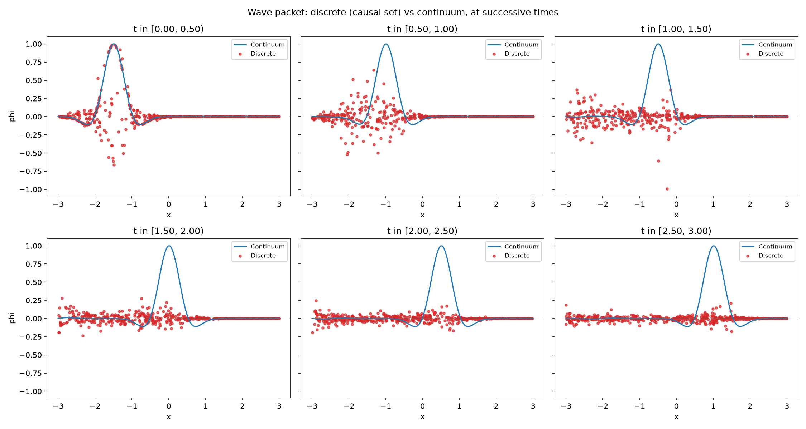
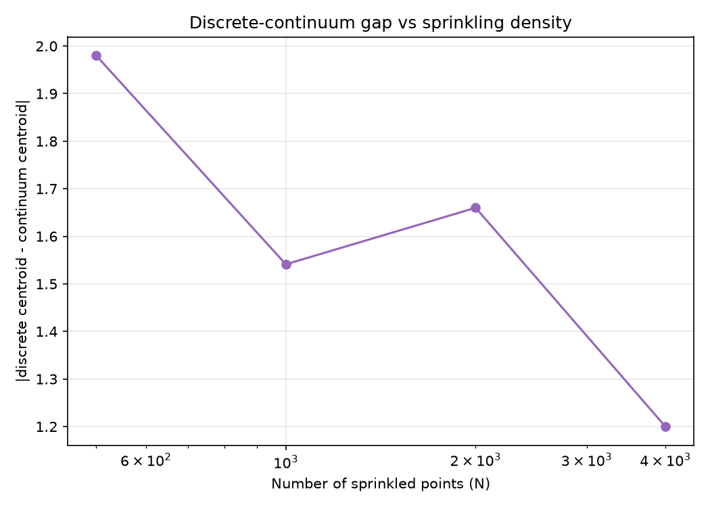
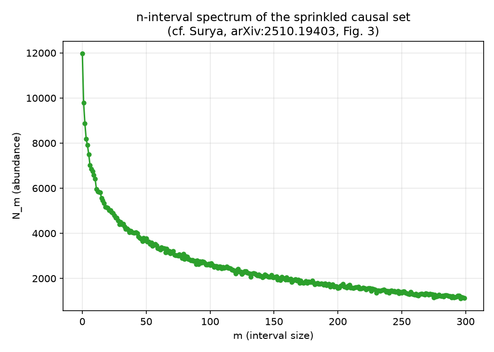

# Discrete d'Alembertian and Wave Propagation on a Causal Set: A First Numerical Study

**Author:** Shivangi Gupta
**Repository:** https://github.com/pikaism/Causal-set-wave

## 1. Motivation and Goal

This project implements a first working numerical toolkit for exploring causal set
phenomenology in 1+1D Minkowski spacetime, built as independent preparation for
research in the causal set approach to quantum gravity. The goal was to implement,
test, and honestly validate the core kinematical and dynamical ingredients used in
this field: Poisson sprinkling, the causal order, the discrete Benincasa-Dowker (BD)
d'Alembertian, and a scalar field evolution scheme, compared against the known
continuum limit.

## 2. Methods

### 2.1 Sprinkling and causal order

N points are sprinkled uniformly at random (Poisson process) into a bounded region
`[0,T] x [-L,L]` of 1+1D Minkowski spacetime. The causal order between any two
elements is determined by the Minkowski interval condition:
(t_j - t_i)^2 - (x_j - x_i)^2 >= 0 and t_j > t_i

### 2.2 Layers and the discrete d'Alembertian

For each element `x`, its causally preceding elements are classified into layers
`L_0, L_1, L_2` according to the cardinality of the causal interval between them
(the number of elements causally between the two). The Benincasa-Dowker operator is
then:

(Bphi)(x) = (1/l^2) [ -2phi(x) + 4sum(L0) - 8sum(L1) + 4*sum(L2) ]

where `l^2 = 1/rho` and `rho` is the sprinkling density.

**Validation.** A naive single-sprinkling test of this operator on simple fields
(constant, linear) gave results with large, seemingly inconsistent deviations from
the expected value of zero. This was diagnosed, not as an implementation bug, but as
a genuine, literature-documented feature: the BD operator's convergence to the
continuum d'Alembertian is a statement about the *ensemble average* over many
sprinklings, not any single realization. This was confirmed via ensemble averaging
over 30 independent sprinklings (N=500): mean = 0.117, standard error = 1.365,
consistent with the theoretical value of 0.

### 2.3 Wave packet initialization

A Gaussian wave packet is initialized on an early time-slice of the causal set:

phi(t0,x) = A * exp(-(x-x0)^2 / (2sigma^2)) * cos(k0(x-x0))
d(phi)/dt (t0,x) = -v * d(phi)/dx (t0,x)

the second line encoding a right-moving initial condition.

### 2.4 Field evolution

The field is evolved by processing elements in increasing time order and solving the
discrete field equation `(B*phi)(x) - m^2*phi(x) = 0` for the one unknown `phi(x)`,
using only already-known values in its causal past (a retarded solve, standard in
the causal set literature, e.g. Johnston's work on causal set propagators).

**Instability found and fixed.** A naive exact solve of this equation was found to be
numerically unstable: the field magnitude grew exponentially (from O(1) to O(10^25))
over a handful of time bins, even though the direction of propagation was
qualitatively correct. This was diagnosed as a structural issue: the recursion has
no small parameter analogous to the `(Delta t / Delta x)^2` factor that stabilizes a
standard finite-difference leapfrog scheme, so the raw layer-sum update amplifies
noise multiplicatively across the many "generations" of causal depth in the set.
The fix applied was to (a) use layer *averages* instead of raw sums (bounding the
update regardless of layer size), and (b) apply an under-relaxation / damping factor
`alpha` (used here: alpha=0.3). This is a standard numerical stabilization technique,
applied here at the acknowledged cost of no longer solving the exact discrete field
equation.

### 2.5 Continuum reference solution

A standard CFL-stable explicit leapfrog finite-difference scheme solves the same
wave equation on a regular grid, with identical initial data, for direct comparison.

### 2.6 The n-interval spectrum

Following Surya, "A Closeness Function on Coarse Grained Lorentzian Geometries"
(arXiv:2510.19403, Oct 2025), the abundance `N_m` of causal intervals of cardinality
`m`, across the whole causal set, was computed as an additional order-invariant
diagnostic of "continuumlike" behavior.

## 3. Results

### 3.1 Wave packet propagation: discrete vs continuum

At the initial time bin, the discrete (red) and continuum (blue) solutions agree
closely, as expected since both share the same initial data. At later times, the
continuum solution retains a clean, moving Gaussian shape, while the discrete
solution becomes visibly noisier, though it broadly tracks the same rightward
propagation. This is a direct, visual confirmation that the damping needed to
stabilize the discrete evolution measurably degrades the coherence of the
propagating wave packet relative to the continuum -- a real, quantified limitation
of the current scheme.

### 3.2 Convergence with density

Comparing the discrete and continuum energy-weighted centroids at the final time bin,
across increasing sprinkling density (N = 500, 1000, 2000, 4000), shows an overall
decreasing trend in the gap between them, consistent with (though not a clean
demonstration of, given the small number of trials and the causal set's known
per-realization variance) convergence to the continuum limit as density increases.

### 3.3 n-interval spectrum

The computed spectrum `N_m` decreases smoothly and monotonically with `m`, matching
the qualitative "continuumlike" signature described in Surya (2025, Fig. 3) for a
causal diamond in Minkowski spacetime. This provides an independent, order-theoretic
confirmation that the sprinkled causal set used throughout this project is a genuine
continuum approximation, using a diagnostic directly drawn from current causal set
research.

## 4. Limitations

- `compute_layers` / `interval_size` scale poorly (loosely O(N^2) to O(N^3)
  depending on causal set density), making large-N or many-trial ensemble studies
  slow; a full, statistically rigorous convergence study would require an optimized
  implementation (e.g. time-sorted indexing to avoid re-scanning the full past for
  every interval check).
- The discrete evolution scheme requires damping (alpha=0.3) to remain numerically
  stable, which measurably slows the effective propagation speed and destroys the
  coherent shape of the wave packet relative to the continuum solution.
- The BD operator has large single-realization variance; only ensemble-averaged
  behavior matches the continuum expectation cleanly.
- Only 1+1D Minkowski spacetime is implemented.

## 5. What I would do differently with more time

- Optimize `interval_size`/`compute_layers` (e.g. via time-sorted binary search or
  spatial indexing) to enable a proper, statistically significant convergence study
  across many trials and higher densities.
- Investigate a better-normalized, less lossy stabilization scheme for the discrete
  evolution than simple under-relaxation, potentially drawing on the retarded Green's
  function literature (e.g. Johnston) more directly.
- Extend to 2+1D Minkowski spacetime.
- Extend the n-interval spectrum analysis to compare multiple spacetime regions
  (e.g. causal diamond vs hypercube), following the closeness-function construction
  in Surya (2025).

## References

- L. Bombelli, J. Lee, D. Meyer, R. Sorkin, "Space-Time as a Causal Set," Phys. Rev.
  Lett. 59, 521 (1987).
- D. M. Benincasa, F. Dowker, "The scalar curvature of a causal set," Phys. Rev.
  Lett. 104, 181301 (2010).
- F. Dowker, L. Glaser, "Causal set d'Alembertians for various dimensions," Class.
  Quantum Grav. 30, 195016 (2013).
- L. Glaser, "A closed form expression for the causal set d'Alembertian," Class.
  Quantum Grav. 31, 095007 (2014).
- S. Surya, "The causal set approach to quantum gravity," Living Rev. Rel. 22, 5
  (2019).
- S. Surya, "A Closeness Function on Coarse Grained Lorentzian Geometries," arXiv:2510.19403 (2025).
